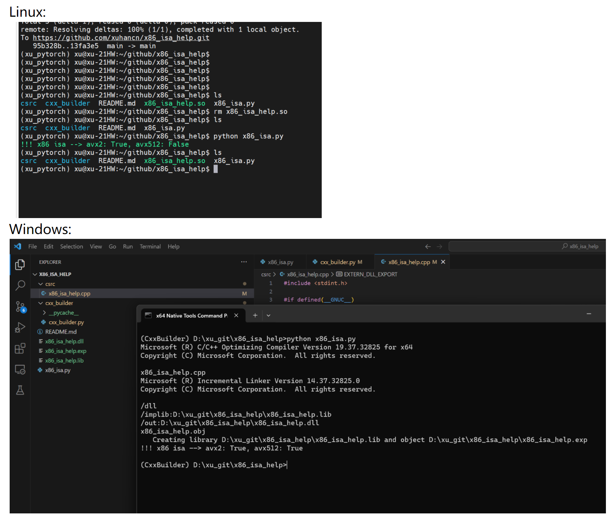

# x86_isa_help

This project is a demo to show how to write a cpp code read cpuid to check x86 ISAs.

## 2023/11/30

Current code is works use pytorch cpp_extension load build code, and use pybuild11 bind api. This solution can proof it works but still some issues:
> 1. cpp_extension load is depends on ninja.
> 2. cpp_extension is include all python and torch dependencies, so it is build very slow.
> 3. pybuild11 is also make build slow, use ctypes to replace it seems a better api binder.

## 2023/12/4
Current code status:
> 1. Write a cxx_builder can jit build the cpp code. It is much faster than pytorch cpp_extension.
> 2. Use ctypes to replace pybuild11.
> 3. It works on Linux.

## 2023/12/5
Status:
> 1. It works on Windows also.
> 2. Add some design guide.
> 3. Add demo snapshot to readme.



## Build speed compared between 'ctypes' and 'cpp_extension load'
ctypes:
```cmd
(xu_pytorch) xu@xu-21HW:~/github/x86_isa_help$ time python x86_isa.py
!!! x86 isa --> avx2: True, avx512: False

real    0m0.088s
user    0m0.063s
sys     0m0.020s
```
cpp_extension load:
```cmd
(xu_pytorch) xu@xu-21HW:~/github/x86_isa_help$ time python x86_isa.py
Using /home/xu/.cache/torch_extensions/py310_cpu as PyTorch extensions root...
Emitting ninja build file /home/xu/.cache/torch_extensions/py310_cpu/x86_isa_help/build.ninja...
Building extension module x86_isa_help...
Allowing ninja to set a default number of workers... (overridable by setting the environment variable MAX_JOBS=N)
[1/2] c++ -MMD -MF x86_isa_help.o.d -DTORCH_EXTENSION_NAME=x86_isa_help -DTORCH_API_INCLUDE_EXTENSION_H -DPYBIND11_COMPILER_TYPE=\"_gcc\" -DPYBIND11_STDLIB=\"_libstdcpp\" -DPYBIND11_BUILD_ABI=\"_cxxabi1016\" -isystem /home/xu/anaconda3/envs/xu_pytorch/lib/python3.10/site-packages/torch/include -isystem /home/xu/anaconda3/envs/xu_pytorch/lib/python3.10/site-packages/torch/include/torch/csrc/api/include -isystem /home/xu/anaconda3/envs/xu_pytorch/lib/python3.10/site-packages/torch/include/TH -isystem /home/xu/anaconda3/envs/xu_pytorch/lib/python3.10/site-packages/torch/include/THC -isystem /home/xu/anaconda3/envs/xu_pytorch/include/python3.10 -D_GLIBCXX_USE_CXX11_ABI=1 -fPIC -std=c++17 -O2 -c /home/xu/github/x86_isa_help/csrc/x86_isa_help.cpp -o x86_isa_help.o
[2/2] c++ x86_isa_help.o -shared -L/home/xu/anaconda3/envs/xu_pytorch/lib/python3.10/site-packages/torch/lib -lc10 -ltorch_cpu -ltorch -ltorch_python -o x86_isa_help.so
Loading extension module x86_isa_help...
!!! x86 isa --> avx2: True, avx512: False

real    0m11.874s
user    0m11.689s
sys     0m1.929s
```